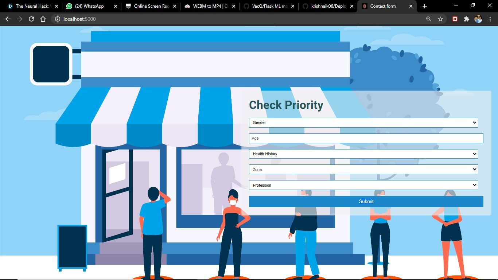
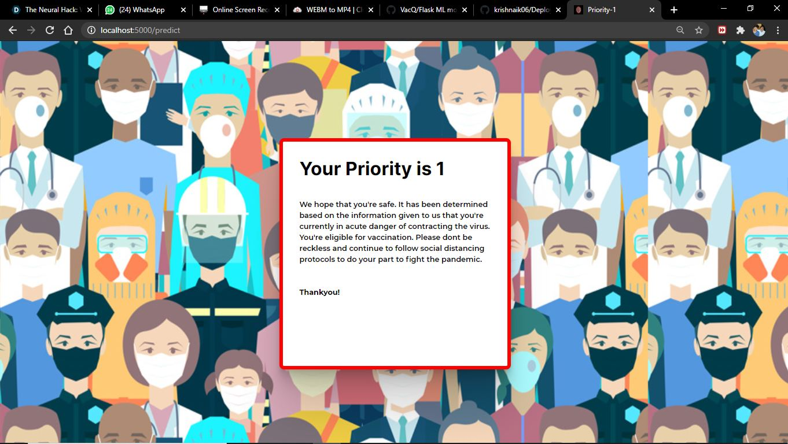
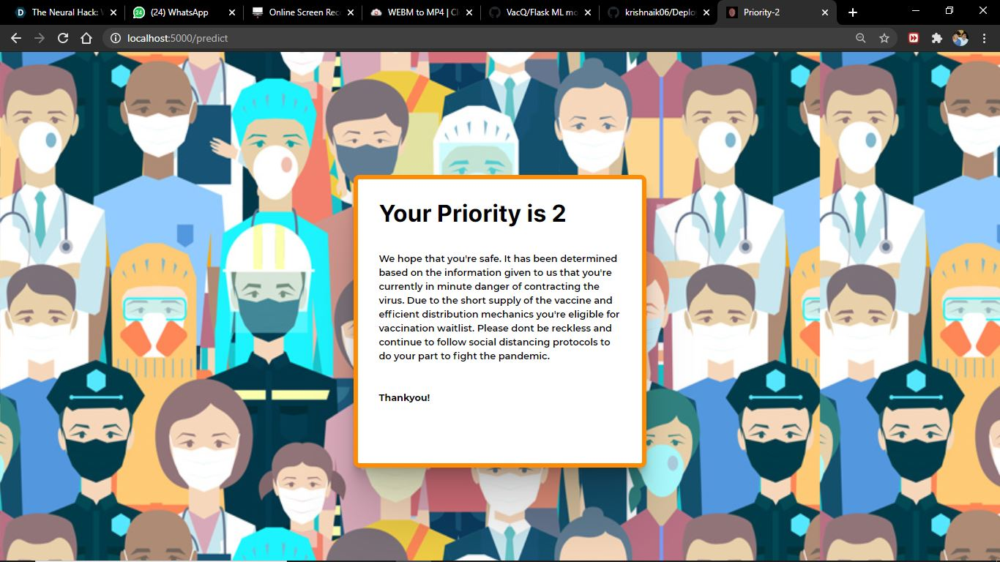
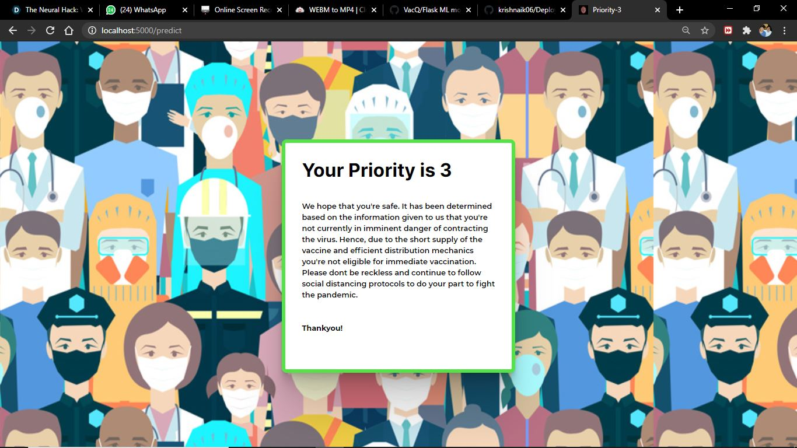

# Prerequisites
You must have Scikit Learn, Pandas (for Machine Leraning Model) and Flask (for API) installed.

Go to command line, cd to the directory where this folder is cloned. Type "python app.py".    

  
  
  
  
